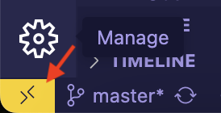
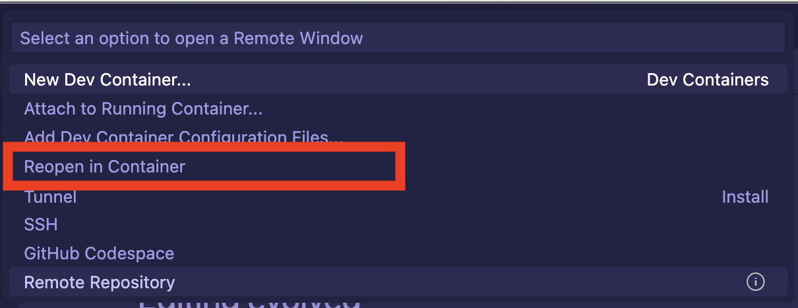

# Using AWS Credentials in a Dev Container

This project aims to provide you an example of how to use AWS credentials when developing in a Dev Containers.

I have written an article about it and you can find it at https://theindiecoder/posts/use-aws-credentials-in-a-dev-container/.

# Prerequisites

Whether you are a macOS user or a Windows user, you need to have the following installed:

1. Visual Studio Code
2. VS Code Dev Containers extension
3. Docker Desktop
4. AWS credentials configured on your local machine. 

I have prepared this guide as a macOS user, so I have not tried running Dev Containers on Windows or Linux. If you are a Windows or Linux user, please refer to the Visual Studio Code documentation for [installation](https://code.visualstudio.com/docs/devcontainers/containers#installation) instructions.

-------

1. Fork this repository.

2. Open the repository with VS Code.

3. In the bottom left corner of your VS Code window, click on the `Dev Container Extension` button. 
.

4. A setup wizard will pop up, in the middle of the window. Select the Reopen in Container option. 
.

5. open a New Terminal.

6. run ```aws s3 ls```

Congratulations!
You are now able to use AWS credentials in a Dev Container! 🚀